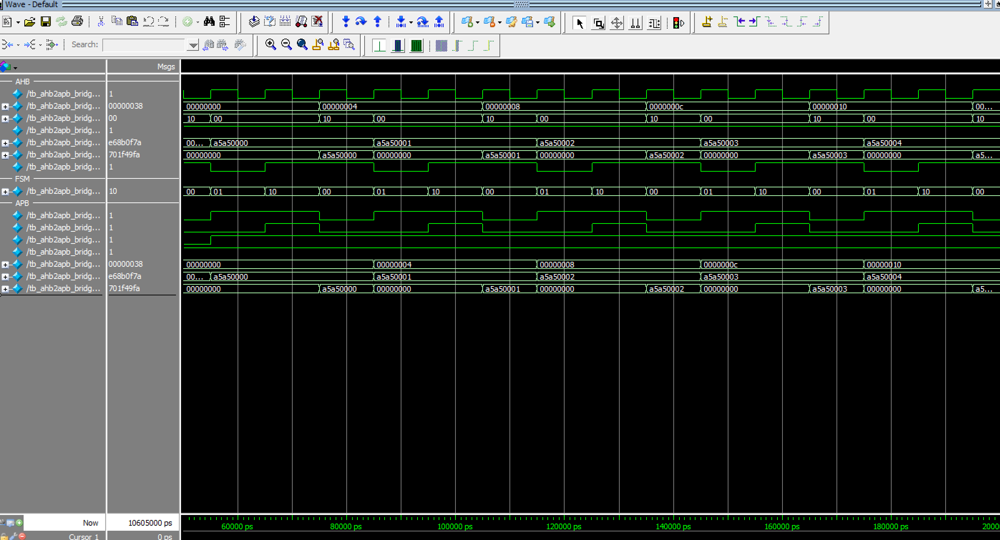

# AHB-to-APB Bridge: Design & Verification

An AHB-Lite slave to APB master bridge in SystemVerilog, with a self-checking testbench.

## Overview
Converts transactions from the high-performance AHB bus into the two-phase APB protocol used by low-speed peripherals.

## Architecture
FSM with three states, following the APB specification:

| State  | PSEL | PENABLE | HREADYOUT | Description |
|--------|------|---------|-----------|-------------|
| IDLE   | 0 | 0 | 1 | Wait for a valid AHB transfer (HSEL & HTRANS[1] & HREADY) |
| SETUP  | 1 | 0 | 0 | APB setup phase, AHB stalled |
| ACCESS | 1 | 1 | PREADY | APB access phase, held until PREADY |

- Address and control are latched in the AHB address phase.
- `HWDATA` passes straight to `PWDATA` (held stable by the master while stalled).
- Supports APB wait states through `PREADY`, and back-to-back transfers (ACCESS → SETUP).
- `HRESP` is tied to OKAY.

## Verification
`tb/tb_ahb2apb_bridge.sv` contains:
- AHB master BFM (`ahb_write`, `ahb_read` tasks)
- APB slave model with configurable wait states (tested with 0 and 2)
- Reference-memory scoreboard
- APB protocol monitor (PENABLE without PSEL, ACCESS without SETUP)
- Directed tests (write/read all 16 locations) and 100 random transactions per configuration

## Run
Windows (Command Prompt / PowerShell):
```bat
sim\run.bat            :: Icarus Verilog
sim\run.bat questa     :: ModelSim / Questa
```
Linux / macOS / Git Bash:
```bash
./sim/run.sh            # Icarus Verilog
./sim/run.sh questa     # ModelSim / Questa
```
Expected last line: `RESULT: TEST PASSED`

## Files
```
rtl/ahb2apb_bridge.sv
tb/tb_ahb2apb_bridge.sv
sim/run.sh, sim/run.bat
docs/            <- add waveform screenshots here
```

## Results


## Possible extensions
Wait-state and error (`PSLVERR` → `HRESP`) handling, burst support, SVA protocol assertions.
